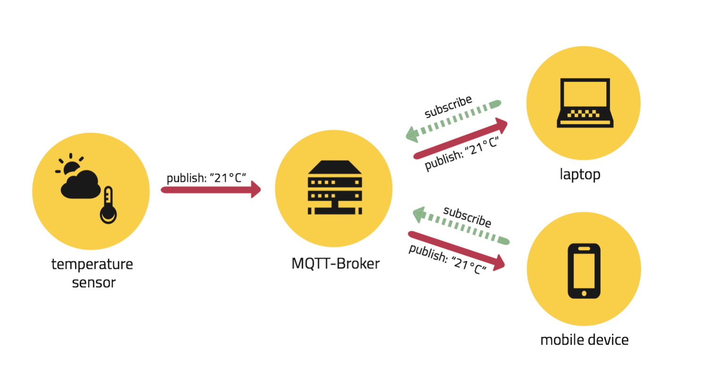
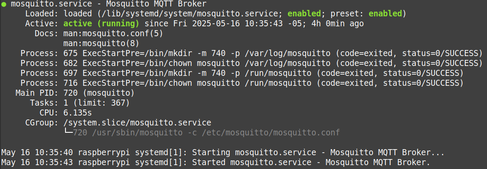
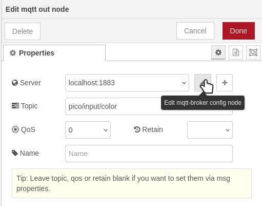
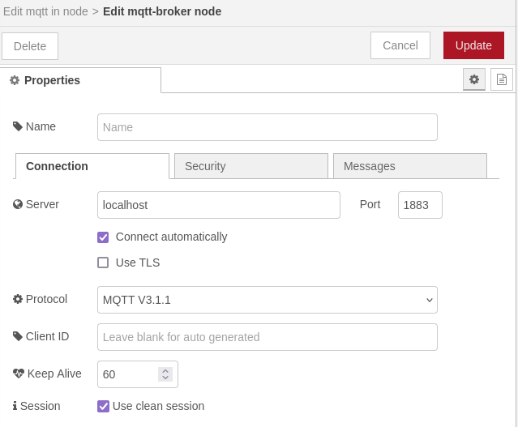
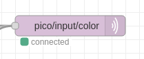
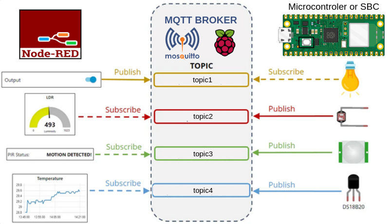
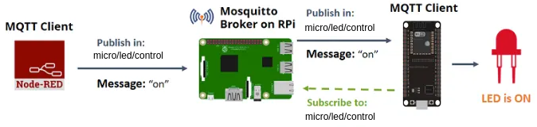

# Lab05: MQTT en Raspberry Pi + microcontrolador con Micropython

Ìndice:

1. [Objetivos de aprendizaje](#1-objetivos-de-aprendizaje)
2. [Introducción](#2-introducción)
3. [Requisitos](#3-requisitos)
4. [Procedimiento](#4-procedimiento)
4.1 [Parte 1](#41-parte-1-instalación-de-herramientas)
4.2 [Parte 2](#42-parte-2-actividad-práctica---controlar-un-led-mediante-mqtt)
5. [Entregables](#5-entregables)
-----------------------------------------------------


## 1. Objetivos de aprendizaje

1. Comprender la arquitectura y funcionamiento de **MQTT**, identificando el rol del broker, los clientes y el modelo de publicación/suscripción.

2. Instalar y configurar Mosquitto en una Raspberry Pi como broker **MQTT** central para la comunicación de dispositivos IoT.

3. Integrar Node-RED con **MQTT** para publicar y suscribirse a mensajes, visualizando datos en tiempo real.

4. Programar un microcontrolador (ESP32 o Raspberry Pi Pico W) para enviar y recibir mensajes **MQTT** mediante MicroPython.

5. Diseñar una solución IoT básica, implementando un flujo completo que controle un LED a través de mensajes **MQTT** enviados desde Node-RED.


## 2. Introducción

### MQTT 

**MQTT**, que significa «Message Queue Telemetry Transport», es un protocolo basado en el modelo de publicación y suscripción (pub/sub). Es muy usado en comunicaciones máquina a máquina (M2M) gracias a su alta eficiencia y bajo consumo de recursos.

* **MQTT** se enfoca en la transmisión de datos a nivel de byte, mientras que HTTP en la transmisión de documentos. 

* HTTP funciona como un modelo cliente-servidor (o petición-respuesta), mientras que **MQTT** funciona mediante publicaciones y suscripciones a un tema (*topic*), mediante un **Broker** (agente que gestiona las publicaciones y suscripciones).

* En **MQTT** se mantiene la conexión y se pueden compartir pings o latidos («heartbeats») para mantenerla abierta. HTTP sólo crea una conexión cuando se necesita enviar una petición. 

* HTTP establece una conexión TCP half-duplex, mientras que en **MQTT** es full-duplex. 

* **MQTT** es capaz de transportar datos crudos en binario, mientras que HTTP requiere una codificación en base 64. 

<p align="center">
 
</p>


### El broker MQTT seleccionado: Mosquitto.

El broker es el servidor central que recibe todos los mensajes **MQTT**, los filtra y los distribuye a los clientes suscritos. En este laboratorio se usará **Mosquitto** que es  un broker *open* *source*.


## 3. Requisitos

### Hardware

1. Raspberry Pi.

2. Fuente de alimentación adecuada.

3. Computador local para conexión SSH.

4. Microcontrolador: ESP32 o Raspberry Pi Pico W.

5. LED y resistencia (220Ω o 330Ω) para la práctica de control físico.

6. Cables jumper para conexión del LED al microcontrolador.

### Software

1. Sistema operativo Raspberry Pi OS correctamente instalado y configurado.

2. Acceso ```SSH``` habilitado en la Raspberry Pi.

3. ```Node.js``` y ```npm```.

4. Node-RED.

5. Mosquitto y mosquitto-clients (instalados durante el laboratorio).

6. Python 3 instalado en la Raspberry Pi.


### Conexión de red

Raspberry Pi y computador local conectados a la misma red local para la comunicación mediante SSH y acceso a la interfaz web de Node-RED.


## 4. Procedimiento

### 4.1 Parte 1: Instalación de herramientas

#### Pasos para instalar Mosquitto (broker MQTT) en Raspberry Pi:

1. Actualizar la Raspberry Pi:

    ```
    sudo apt update
    sudo apt upgrade -y
    ```

2. Instalar **Mosquitto** y clientes:

   Los clientes **Mosquitto** son herramientas de línea de comandos que  permiten enviar y recibir mensajes **MQTT** para probar y usar el broker. Por ejemplo:

    * ```mosquitto_pub``` para publicar mensajes en un *topic*.

    * ```mosquitto_sub``` para suscribirte y recibir mensajes de un *topic*.
  
    Para instalar mosquittlo:

    ```
    sudo apt install mosquitto mosquitto-clients -y
    ```

3. Habilitar **Mosquitto** para que inicie con el sistema:

    Cuando se instala **Mosquitto**, el broker **MQTT** se configura como un servicio del sistema (usando systemd en Raspberry Pi OS). Esto significa que puede ejecutarse en segundo plano y atender las conexiones **MQTT** sin que se tenga que iniciar manualmente el programa cada vez que se enciende la Raspberry Pi. Tal y como lo incimos en el laboratorio anterior ejecutando el servicio de ```Node-RED``` en segundo plano.

    Para asegurar que **Mosquitto** se ejecute automáticamente cada vez que se  encienda reinicie la Raspberry Pi, se debe habilitar el servicio. Esto se hace con el siguiente comando:

    ```
    sudo systemctl enable mosquitto
    ```
    Luego, para iniciar el servicio inmediatamente (sin necesidad de reiniciar la Raspberry Pi), se debe ejecutar:

    ```
    sudo systemctl start mosquitto
    ```
    Finalmente, para verificar que el servicio está corriendo correctamente:
    ```
    sudo systemctl status mosquitto
    ```

    Deben ver algo como:

    <p align="center">
    
    </p>

4. Usar nodos MQTT en ```Node-RED```:

    Node-RED incluye por defecto nodos para publicar y suscribirse a mensajes MQTT:

    * mqtt in: para recibir mensajes de un tópico.

    * mqtt out: para publicar mensajes en un tópico.

    **Pasos para conectar Node-RED con Mosquitto:**

    1. Abrir ```Node-RED```.

    2. Arrastrar un nodo **mqtt in** y **mqtt out** desde la paleta de nodos.

    3. Hacer doble clic en el nodo para configurar el servidor **MQTT**:

        <p align="center">
        
        </p>

        En el icono de editar en la fila de ```Server```, es decir, en ```Edit mqtt-broker node``` configurar:

        * **Servidor**: localhost (si Mosquitto está en la misma Raspberry Pi).

        * **Puerto**: 1883 (por defecto).

        <p align="center">
        
        </p>

    4. Configurar el *topic* en los nodos, por ejemplo: 

        * En el nodo **mqtt in** ```micro/sensor/color```.

        * En el nodo **mqtt out** ```micro/led/control```.

    Si la configuración fue correcta deberá ver:

    <p align="center">
        
    </p>


### Integración de dispositivos clientes en la arquitectura MQTT:

Ahora bien, el objetivo de este laboratorio es construir una arquitectura como la que se muestra en la siguiente imagen:

<p align="center">
        
    </p>

Hasta este punto, ya se cuenta con la parte central del sistema, que corresponde al **Broker MQTT**, así como con el componente del lado izquierdo, representado por el cliente Node-RED.

Ahora es necesario incorporar los dispositivos que actuarán como clientes adicionales del **Broker MQTT**. Usualmente, estos clientes son microcontroladores (como ESP32 o Raspberry Pi Pico W) o SBCs (Single Board Computers, por ejemplo, otras Raspberry Pi). Estos dispositivos se encargarán de interactuar con el entorno mediante sensores o actuadores.

En esta arquitectura, dichos dispositivos funcionan como nodos esclavos, mientras que la Raspberry Pi principal, que es el servidor tanto el **Broker MQTT** como ```Node-RED```, actúa como el nodo maestro o servidor central del sistema.

A continuación se enlistan scripts para configurar los dispositivos clientes de acuerdo a la plataforma selccionada:

#### Otra Raspberry Pi SBC

1. Instalar:

    ```
    pip3 install paho-mqtt
    ```
2. Ejecutar el [script](/ECCI-Sistemas-Digitales-3-2025-I-/laboratorios/5_lab05/mqtt_client_rpi.py).


#### Microcontrolador Raspberry Pi Pico W o ESP32:

1. Descargar ```Thonny``` (IDE recomendado) en un PC local:

    ```Thonny``` es un entorno de desarrollo muy sencillo ideal para programar microcontroladores como la Raspberry Pi Pico W. Se puede descargarlo desde: https://thonny.org

2. Instalar ```Thonny```:

    Ejecutar el instalador descargado y sigue las instrucciones. Está disponible para Windows, macOS y Linux.

3. Pasos para conectar el microcontrolador por USB:

   1. Mantener presionado el botón **BOOTSEL**.

   2. Conectarla al puerto USB.

   3. Soltarla una vez conectada.

    4. Deberá aparecer como una unidad de almacenamiento USB.

4. Instalar **MicroPython** en el microcontrolador desde Thonny

    1. Abrir Thonny.

    2. En el menú: Herramientas → Seleccionar intérprete.

    3. Seleccionar:

        1. Interprete: MicroPython (Raspberry Pi Pico)

        2. Puerto: (puede aparecer automáticamente como "USB serial")

### 4.2 Parte 2: Actividad práctica - Controlar un LED mediante MQTT

Se debe implementar un sistema donde Node-RED controla un LED conectado a un microcontrolador (ESP32 o Raspberry Pi Pico W) usando MQTT.

#### Objetivo

Encender y apagar un LED a través de Node-RED enviando mensajes MQTT al microcontrolador.

#### Pasos generales

#### 1. En Node-RED:

Crear un flujo con:

* Un nodo ```inject``` que envíe el mensaje "ON" o "OFF".

* Un nodo ```mqtt out``` configurado con el topic ```micro/led/control```.

#### 2. En el microcontrolador (MicroPython o ESP32):

* Configurar conexión WiFi.

* Suscribirse al topic ```micro/led/control```.

* Encender el LED cuando reciba "ON" y apagarlo con "OFF".

#### Diagrama

<p align="center">
        
    </p>


## 5. Entregables

1. Código fuente: Subir al repositorio el archivo ```.json``` con el flujo implementado en Node-RED.

2. Documentación: En el respectivo ```README.md``` de Github Classroom escribir una documentación técnica describiendo el procedimiento llevado a cabo y los resultados obtenidos.